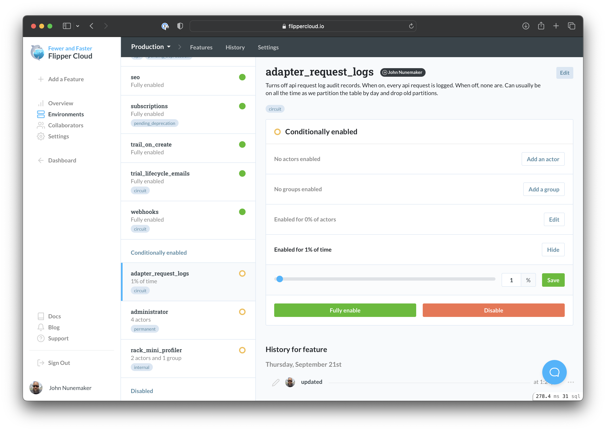

[](https://www.flippercloud.io)

# Flipper

Beautiful, performant feature flags for Ruby.

Control your software &mdash; don't let it control you.

## Installation

Add this line to your application's Gemfile:

    gem 'flipper'

And then execute:

    $ bundle

Or install it yourself with:

    $ gem install flipper

## Getting Started

Flipper is built on adapters for maximum flexibility. Regardless of what database you are using, Flipper can performantly store data in it.

To get started, pick one of our [supported adapters](docs/Adapters.md#officially-supported) and follow the instructions:

* [Active Record](docs/active_record/README.md)
* [Sequel](docs/sequel/README.md)
* [Redis](docs/redis/README.md)
* [Mongo](docs/mongo/README.md)
* [Moneta](docs/moneta/README.md)

Or [roll your own](docs/Adapters.md#roll-your-own). We even provide automatic (rspec and minitest) tests for you, so you know you've built your custom adapter correctly.

Once you've selected an adapter and followed the installation instructions, you should be good to go.

## Flipper UI

If you prefer a web UI to an IRB console, you can setup the [Flipper UI](docs/ui/README.md).

It's simple and pretty.


## Flipper Cloud

Or, (even better than OSS + UI) use [Flipper Cloud](https://www.flippercloud.io) which comes with:

* **everything in one place** &mdash; no need to bounce around from different application UIs or IRB consoles.
* **permissions** &mdash; grant access to everyone in your organization or lockdown each project to particular people.
* **multiple environments** &mdash; production, staging, enterprise, by continent, whatever you need.
* **personal environments** &mdash; no more rake scripts or manual enable/disable to get your laptop to look like production. Every developer gets a personal environment that inherits from production that they can override as they please ([read more](https://www.johnnunemaker.com/flipper-cloud-environments/)).
* **no maintenance** &mdash; we'll keep the lights on for you. We also have handy webhooks for keeping your app in sync with Cloud, so **our availability won't affect yours**. All your feature flag reads are local to your app.
* **audit history** &mdash; every feature change and who made it.
* **rollbacks** &mdash; enable or disable a feature accidentally? No problem. You can roll back to any point in the audit history with a single click.

[](https://www.flippercloud.io)

Cloud is super simple to integrate with Rails ([demo app](https://github.com/fewerandfaster/flipper-rails-demo)), Sinatra or any other framework.

## Examples

Want to get a quick feel for what it looks like to work with Flipper? Check out the following example or the [examples directory](examples/). You might also want to peek at the [DSL](lib/flipper/dsl.rb) and [Feature](lib/flipper/feature.rb) classes for code/docs.

```ruby
require 'flipper'

Flipper.configure do |config|
  config.default do
    # pick an adapter, this uses memory, any will do, see docs above
    adapter = Flipper::Adapters::Memory.new

    # pass adapter to handy DSL instance
    Flipper.new(adapter)
  end
end

# check if search is enabled
if Flipper.enabled?(:search)
  puts 'Search away!'
else
  puts 'No search for you!'
end

puts 'Enabling Search...'
Flipper.enable(:search)

# check if search is enabled
if Flipper.enabled?(:search)
  puts 'Search away!'
else
  puts 'No search for you!'
end
```

## Docs

A few miscellaneous docs with more info for the hungry.

* [Gates](docs/Gates.md) - Boolean, Groups, Actors, % of Actors, and % of Time
* [Adapters](docs/Adapters.md) - Mongo, Redis, Cassandra, Active Record...
* [Instrumentation](docs/Instrumentation.md) - ActiveSupport::Notifications and Statsd
* [Optimization](docs/Optimization.md) - Memoization middleware and Cache adapters
* [Web Interface](docs/ui/README.md) - Point and click...
* [API](docs/api/README.md) - HTTP API interface
* [Caveats](docs/Caveats.md) - Flipper beware! (see what I did there)
* [Docker-Compose](docs/DockerCompose.md) - Using docker-compose in contributing

## Contributing

1. Fork it
2. Create your feature branch (`git checkout -b my-new-feature`)
3. Run the tests (`bundle exec rake`)
4. Commit your changes (`git commit -am 'Added some feature'`)
5. Push to the branch (`git push origin my-new-feature`)
6. Create new Pull Request

## Releasing

1. Update the version to be whatever it should be and commit.
2. `script/release`
3. Profit.

## Brought To You By

| pic | @mention | area |
|---|---|---|
|  | [@jnunemaker](https://github.com/jnunemaker) | most things |
|  | [@alexwheeler](https://github.com/alexwheeler) | api |
|  | [@thetimbanks](https://github.com/thetimbanks) | ui |
|  | [@lazebny](https://github.com/lazebny) | docker |
