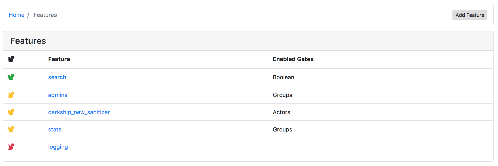
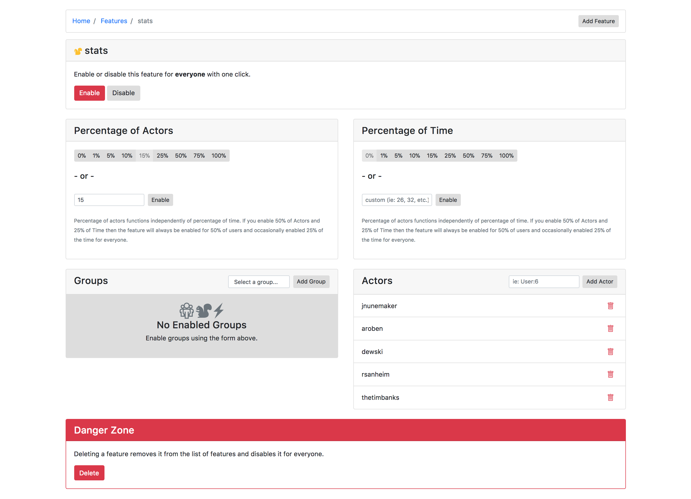
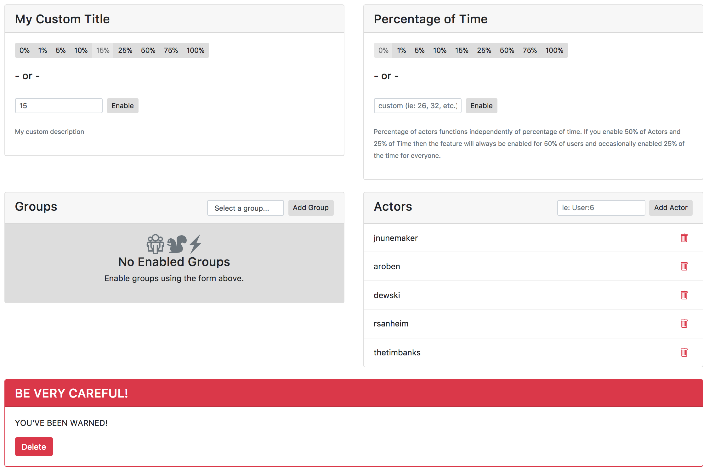
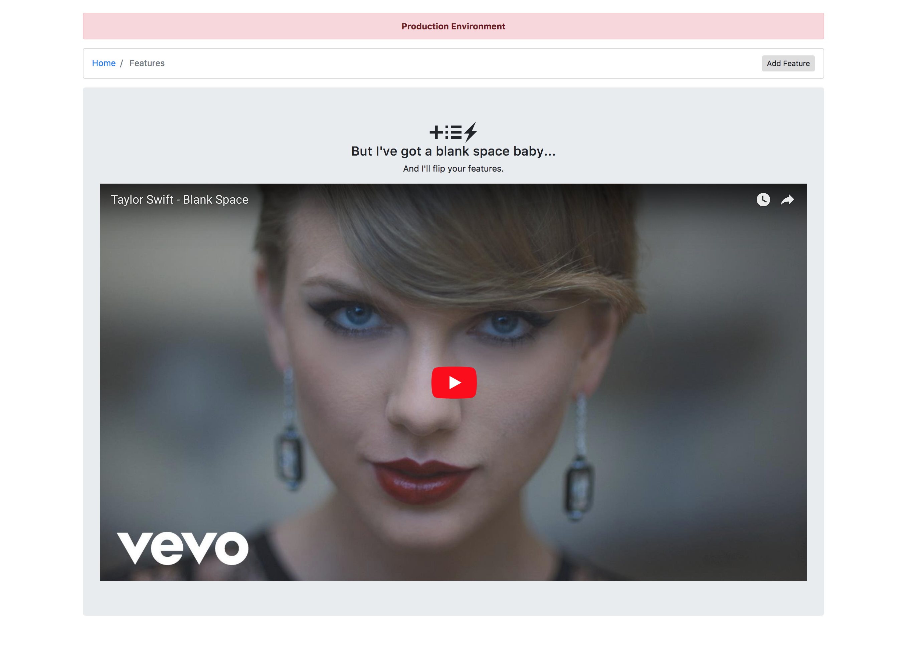

# Flipper::UI

UI for the [Flipper](https://github.com/jnunemaker/flipper) gem.

## Screenshots

Viewing list of features:


Viewing an individual feature:


## Installation

Add this line to your application's Gemfile:

    gem 'flipper-ui'

And then execute:

    $ bundle

Or install it yourself as:

    $ gem install flipper-ui

## Usage

### Rails

Given that you've already initialized `Flipper` as per the [flipper](https://github.com/jnunemaker/flipper) readme, you can mount `Flipper::UI` to a route of your choice:

```ruby
# config/routes.rb
YourRailsApp::Application.routes.draw do
  mount Flipper::UI.app(Flipper) => '/flipper'
end
```

If you'd like to lazy load flipper, you can instead pass a block to initialize it:

```ruby
# config/routes.rb
YourRailsApp::Application.routes.draw do
  flipper_block = lambda {
    # some flipper initialization here, for example:
    adapter = Flipper::Adapters::Memory.new
    Flipper.new(adapter)
  }
  mount Flipper::UI.app(flipper_block) => '/flipper'
end
```

#### Security

You almost certainly want to limit access when using Flipper::UI in production.

##### Basic Authentication via Rack
The `Flipper::UI.app` method yields a builder instance prior to any predefined middleware. You can insert the `Rack::Auth::Basic` middleware, that'll prompt for a username and password when visiting the defined (i.e., `/flipper`) route.

```ruby
# config/routes.rb

flipper_app = Flipper::UI.app(Flipper.instance) do |builder|
  builder.use Rack::Auth::Basic do |username, password|
    # Verify credentials
  end
end
mount flipper_app, at: '/flipper'
```

##### Route Constraints
It is possible to use [routes constraints](http://guides.rubyonrails.org/routing.html#request-based-constraints) to limit access to routes:

```ruby
# config/routes.rb

flipper_constraint = lambda { |request| request.remote_ip == '127.0.0.1' }
constraints flipper_constraint do
  mount Flipper::UI.app(flipper) => '/flipper'
end
```

Another example is to use the `current_user` when using a gem-based authentication system (i.e., [warden](https://github.com/hassox/warden) or [devise](https://github.com/plataformatec/devise)):

```ruby
# initializers/admin_access.rb

class CanAccessFlipperUI
  def self.matches?(request)
    current_user = request.env['warden'].user
    current_user.present? && current_user.respond_to?(:admin?) && current_user.admin?
  end
end

# config/routes.rb

constraints CanAccessFlipperUI do
  mount Flipper::UI.app(flipper) => '/flipper'
end
```

### Standalone

Minimal example for Rack:

```ruby
# config.ru

require 'flipper-ui'

adapter = Flipper::Adapters::Memory.new
flipper = Flipper.new(adapter)

run Flipper::UI.app(flipper) { |builder|
  builder.use Rack::Session::Cookie, secret: "something long and random"
}
```

The key is that you need to have sessions setup. Rails does this for you, so this step isn't necessary, but for standalone rack, you'll need it. Without sessions setup, you will receive a Runtime error like:

```
RuntimeError: you need to set up a session middleware *before* Rack::Protection::RemoteToken.
```

See [examples/ui/basic.ru](https://github.com/jnunemaker/flipper/blob/master/examples/ui/basic.ru) for a more full example

### Configuration

Flipper UI can be customized via `configure`, which yields a configuration instance for setting the text on the five main sections of the UI feature view.

* `config.actors`
* `config.groups`
* `config.percentage_of_actors`
* `config.percentage_of_time`
* `config.delete`

Each of these methods returns a [Flipper::UI::Option](https://github.com/jnunemaker/flipper/blob/master/lib/flipper/ui/configuration/option.rb) that responds to `title=`, `description=` as seen below.

*e.g. customzing the percentage_of_actors and delete sections' titles and descriptions*
```ruby
Flipper::UI.configure do |config|
  config.percentage_of_actors.title = "My Custom Title"
  config.percentage_of_actors.description = "My custom description"

  config.delete.title = "BE VERY CAREFUL!"
  config.delete.description = "YOU'VE BEEN WARNED!"
end
```

results in:



### Banner

Flipper UI can display a banner across the top of the page. The `banner_text` and `banner_class` can be configured by using the `Flipper::UI.configure` block as seen below.

```ruby
Flipper::UI.configure do |config|
  config.banner_text = 'Production Environment'
  config.banner_class = 'danger'
end
```

By default the `environment` is set to an empty string so no banner will show. If you wish to customize the look of the banner, you can set `banner_class` to one of the bootstrap color classes: `primary`, `secondary`, `success`, `danger`, `warning`, `info`, `light`, or `dark`. The default `banner_class` is `danger`.

The above configuration results in:



## Contributing

1. Fork it
2. Create your feature branch (`git checkout -b my-new-feature`)
3. **Fire up the app** (`script/server`)
4. **Start up guard** (`bundle exec guard` for automatic coffeescript/sass compilation and such).
5. Run the tests `bundle exec rake`
6. Commit your changes (`git commit -am 'Added some feature'`)
7. Push to the branch (`git push origin my-new-feature`)
8. Create new Pull Request
